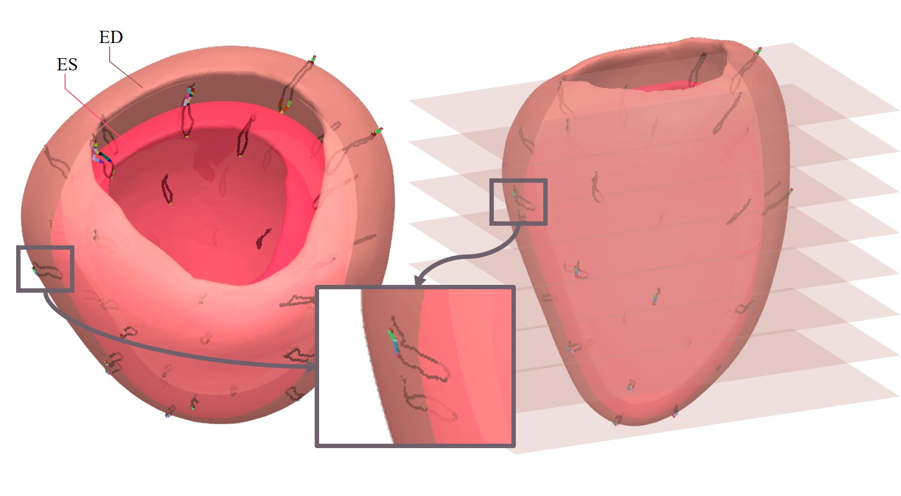
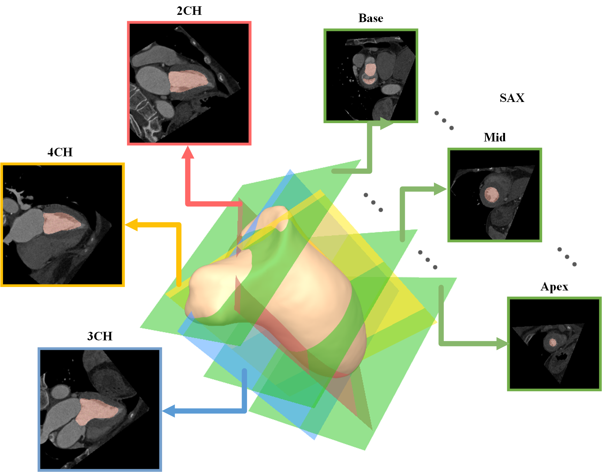
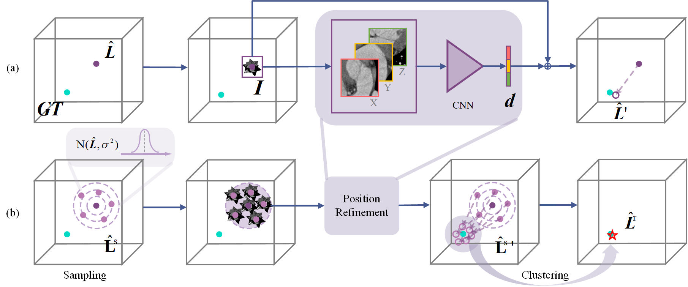

# About Me

  

Here is <strong>Xiaohan Yuan (袁小涵)</strong>.

I am currently pursuing my Ph.D. at <a href="https://www.seu.edu.cn/" target="_blank">Southeast University (SEU)</a>, where I am actively engaged in research at the Visual and Cognitive Laboratory (VCL), advised by <a href="https://www.yangangwang.com/" target="_blank">Yangang Wang</a>. 
 
I am researching in the interdisciplinary field of <strong>computer vision</strong> and <strong>medical imaging</strong>, with the goal of comprehending the structural, dynamic, and functional aspects of anatomical organs through the analysis of medical images. My current research interests are primarily focused on cardiac-related studies.

 

---

## News and Updates
- **Jul 2023：** One paper accepted by ICCV 2023.
- **Jul 2023：** Attending the 10th Medical Imaging Computing Seminar ([MICS 2023](https://aim.nuist.edu.cn/MICS/mics2023.htm)) held in Taiyuan, China.
- **Jun 2023：** Attending the 13th Vision and Learning Seminar ([VALSE 2023](http://valser.org/2023/#/)) held in Wuxi, China.
- **Dec 2022：** Attending the 16th Asian Conference on Computer Vision ([ACCV 2022](https://accv2022.org/en/default.asp)) held in Macau SAR, China.
- **Sep 2022：** One paper accepted by ACCV 2022.
- **Jul 2022：** One paper accepted by PRCV 2022.

 

---

## Academic Background

<!-- **[Highlight] I am looking for PhD to start in 2025 Fall. Contact me if you have any leads!** -->

- March 2023 - Current: **Ph.D. Student.**, Southeast University, Nanjing, China
- Sep 2020 - March 2023: **M.S.**, Southeast University, Nanjing, China
- Sep 2016 - June 2020: **B.E.**, Nanjing University of Aeronautics and Astronautics, Nanjing, China

---
## Conference Paper
<head>

</head>

<table>
  <!-- <colgroup>
    <col style="width: 250px;"> 
  </colgroup> -->
<tr><!-- ICCV23 -->
  <td style="text-align: center;"></td>

  <td>
  4D Myocardium Reconstruction with Decoupled Motion and Shape Model 
   <strong>Xiaohan Yuan</strong>, Cong Liu and Yangang Wang IEEE/CVF International Conference on Computer Vision  (<strong>ICCV 2023</strong>) 
  <a href="https://arxiv.org/pdf/2308.14083.pdf" target="_blank">[paper]</a> <a href="https://github.com/yuan-xiaohan/4D-Myocardium-Reconstruction-with-Decoupled-Motion-and-Shape-Model" target="_blank">[code]</a> <a href="https://www.bilibili.com/video/BV1Q8411z7o8/?spm_id_from=888.80997.embed_other.whitelist&t=23" target="_blank">[video]</a>
  </td>
</tr>

<tr><!-- ACCV22 -->
  <td style="text-align: center;"></td>

  <td>
  Slice-mask based 3D Cardiac Shape Reconstruction from CT volume 
   <strong>Xiaohan Yuan</strong>, Cong Liu, Fu Feng, Yinsu Zhu and Yangang Wang Asian Conference on Computer Vision (<strong>ACCV 2022</strong>) 
  <a href="https://openaccess.thecvf.com/content/ACCV2022/papers/Yuan_Slice-mask_based_3D_Cardiac_Shape_Reconstruction_from_CT_volume_ACCV_2022_paper.pdf" target="_blank">[paper]</a> <a href="https://github.com/yuan-xiaohan/Slice-mask-based-3D-Cardiac-Shape-Reconstruction" target="_blank">[code]</a>
  </td>
</tr>

<tr><!-- PRCV22 -->
  <td></td>
  
  <td>
  A 2.5D Coarse-to-fine Framework for 3D Cardiac CT View Planning 
   <strong>Xiaohan Yuan</strong> and Yinsu Zhu  Chinese Conference on Pattern Recognition and Computer Vision (<strong>PRCV 2022</strong>) 
  <a href="https://link.springer.com/content/pdf/10.1007/978-3-031-18910-4_31.pdf" target="_blank">[paper]</a>
  </td>
</tr>

</table>