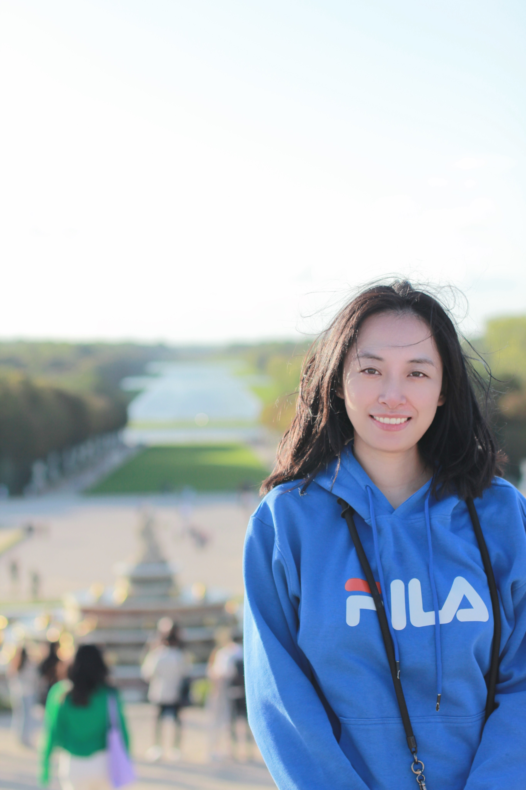

# About Me

  

Here is <strong>Xiaohan Yuan (袁小涵)</strong>.

I am a Ph.D. student in the Vision and Cognition Lab (<a href="https://www.yangangwang.com/" target="_blank">VCL</a>) at Southeast University (<a href="https://www.seu.edu.cn/english/main.htm" target="_blank">SEU</a>) , China, supervised by Prof. (<a href="https://www.yangangwang.com/#me" target="_blank">Yangang Wang</a>) .
Currently, I am a visiting Ph.D. student at the Digital Heart Lab (<a href="https://digitalheartlab.com/" target="_blank">DHlab</a>), National University of Singapore (<a href="https://nus.edu.sg/" target="_blank">NUS</a>), under the supervision of Dr. (<a href="https://digitalheartlab.com/people/lei_li" target="_blank">Lei Li</a>).
 

I am researching in the interdisciplinary field of <strong>computer vision</strong> and <strong>medical imaging</strong>, with the goal of comprehending the structural, dynamic, and functional aspects of anatomical organs through the analysis of medical images. My current research interests are primarily focused on cardiac-related studies.

 

---

## News and Updates
- **July 2025：** Attended the 12th Medical Imaging Computing Seminar ([MICS 2025](https://micsymposium.org/mics2025/)) held in Cixi, China.
- **Mar 2025：** One paper accepted by TIP 2025.
- **Sep 2024：** One paper accepted by TVCG 2024.
- **Sep 2024：** One paper accepted by ACCV 2024.
- **Jul 2024：** Delivered an oral presentation at the 11th Medical Image Computing Seminar ([MICS 2024](https://mics2024-xiamen.github.io/)) held in Xiamen, China. Awarded Second Prize in the MICS 2024 Student Achievement Short Video Competition.
- **Oct 2023：** Attended IEEE/CVF International Conference on Computer Vision ([ICCV 2023](https://iccv2023.thecvf.com/)) held in Paris, France.
- **Jul 2023：** One paper accepted by ICCV 2023.
- **Jul 2023：** Attended the 10th Medical Imaging Computing Seminar ([MICS 2023](https://aim.nuist.edu.cn/MICS/mics2023.htm)) held in Taiyuan, China.
- **Jun 2023：** One paper accepted by IJCAI Workshop 2023.
- **Jun 2023：** Attended the 13th Vision and Learning Seminar ([VALSE 2023](http://valser.org/2023/#/)) held in Wuxi, China.
- **Dec 2022：** Attended the 16th Asian Conference on Computer Vision ([ACCV 2022](https://accv2022.org/en/default.asp)) held in Macau SAR, China.
- **Sep 2022：** One paper accepted by ACCV 2022.
- **Jul 2022：** One paper accepted by PRCV 2022.
- **Oct 2020：** One paper accepted by CAC 2020.

 

---

## Academic Background

<!-- **[Highlight] I am looking for PhD to start in 2025 Fall. Contact me if you have any leads!** -->

- August 2025 - Current: **Visiting Ph.D. Student.**, National University of Singapore, Singapore
- March 2023 - Current: **Ph.D. Student.**, Southeast University, Nanjing, China
- Sep 2020 - March 2023: **M.S.**, Southeast University, Nanjing, China
- Sep 2016 - June 2020: **B.E.**, Nanjing University of Aeronautics and Astronautics, Nanjing, China

