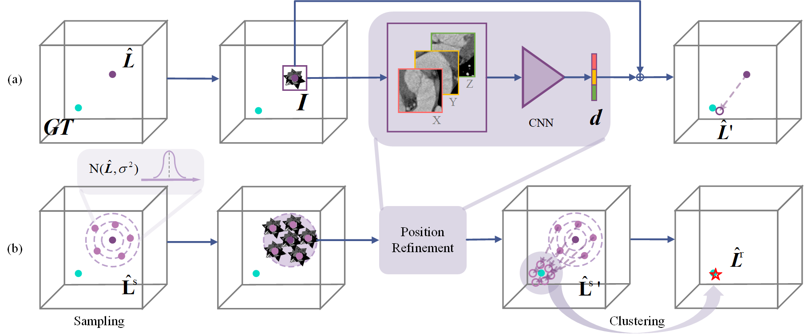

## Conference Paper
<table>
  <colgroup>
    <col style="width: 250px;"> 
  </colgroup>

<tr><!-- ICCV23 -->
  <td style="text-align: center;"></td>
  <td>
  
  
4D Myocardium Reconstruction with Decoupled Motion and Shape Model

   **Xiaohan Yuan**, Cong Liu and Yangang Wang IEEE/CVF International Conference on Computer Vision  (**ICCV 2023**) 
  [[paper]](https://arxiv.org/pdf/2308.14083.pdf) [[code]](https://github.com/yuan-xiaohan/4D-Myocardium-Reconstruction-with-Decoupled-Motion-and-Shape-Model) [[video]](https://www.bilibili.com/video/BV1Q8411z7o8/?spm_id_from=888.80997.embed_other.whitelist&t=23)
  </td>

<tr><!-- ACCV22 -->
  <td style="text-align: center;"></td>
  <td>

  
Slice-mask based 3D Cardiac Shape Reconstruction from CT volume

   **Xiaohan Yuan**, Cong Liu, Fu Feng, Yinsu Zhu and Yangang Wang Asian Conference on Computer Vision (**ACCV 2022**) 
[[paper]](https://openaccess.thecvf.com/content/ACCV2022/papers/Yuan_Slice-mask_based_3D_Cardiac_Shape_Reconstruction_from_CT_volume_ACCV_2022_paper.pdf) [[code]](https://github.com/yuan-xiaohan/Slice-mask-based-3D-Cardiac-Shape-Reconstruction) [[video]](https://whova.com/portal/webapp/hybri1_202112/Artifact/70149)

<tr><!-- PRCV22 -->
  <td></td>
  <td>
  
  
A 2.5D Coarse-to-fine Framework for 3D Cardiac CT View Planning

   **Xiaohan Yuan** and Yinsu Zhu  Chinese Conference on Pattern Recognition and Computer Vision (**PRCV 2022**) 
[[paper]](https://link.springer.com/content/pdf/10.1007/978-3-031-18910-4_31.pdf)
  </td>

</table>    

